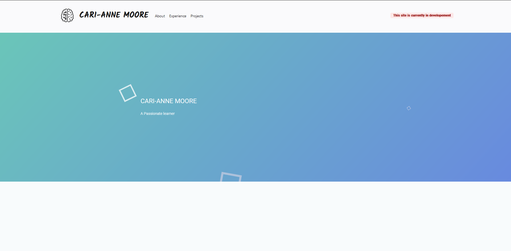

<h1 align="center">
 ctrlrodz.dev - v1
</h1>
<p align="center">
  The first iteration of <a href="https://ctrlrodz.dev" target="_blank">ctrlrodz.dev</a> built with <a href="https://angular.io/" target="_blank">Angular</a> and hosted with <a href="https://vercel.com/" target="_blank">Vercel</a>
</p>



## 🛠 Installation & Set Up

1. Install the Angular CLI

   ```sh
   npm install -g @angular/cli
   ```

2. Install and use the correct version of Node using [NVM](https://github.com/nvm-sh/nvm)

   ```sh
   nvm install
   ```

3. Start the development server

   ```sh
   ng serve
   ```

## 🚀 Building and Running for Production

1. Generate a full static production build

   ```sh
   ng build
   ```


